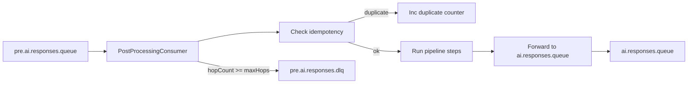

# Message Cycle Mitigation Design

Summary

This document proposes headers, DLQ rules, idempotency, metrics and alerts to prevent infinite LLM loops and repeated processing across services.

Context

ai-routing-service consumes messages from pre.ai.responses.queue and forwards to ai.responses.queue after enrichment. See [`PostProcessingConsumer.java`](lucid-ai-routing-service/src/main/java/com/lucid/automation/airouting/consumer/PostProcessingConsumer.java:67).

Goals

- Prevent repeated LLM calls caused by message cycles.
- Make message processing idempotent and observable.
- Provide safe default DLQ behavior.

Message header schema

Use these standard headers on all messages flowing through AI topics.

```json
{
  "messageId": "uuid-v4",
  "origin": "service-id",
  "hopCount": 0,
  "maxHops": 5,
  "idempotencyKey": "optional-business-key",
  "createdAt": "2025-08-27T...Z"
}
```

Behavioral rules

- At ingress (consumer entry) validate required headers messageId and origin. If missing, add messageId and origin and log.
- If hopCount >= maxHops, send to DLQ with reason hop_limit_exceeded and stop processing.
- Increment hopCount before forwarding to next topic; persist updated headers.
- Before processing, check idempotency store for messageId or idempotencyKey. If found, skip processing and emit duplicate metric.

DLQ and retry policy

- Create topic pre.ai.responses.dlq with schema { originalMessage, reason, service, timestamp }.
- Reasons: hop_limit_exceeded, invalid_payload, processing_error, duplicate.
- DLQ retention and consumer policy: 7 days retention, manual inspection and automated alerts on spikes.

Idempotency store

- Use Redis (SETNX with TTL) or DB table with TTL for messageId / idempotencyKey.
- TTL should cover expected processing window (e.g., 24h).
- On processing start, write key; on success keep TTL or extend; on failure delete or set failure marker.

Headers preservation on produce

- When producing, preserve existing headers and forward updated hopCount and origin.
- Example producer usage in code: see [`AIMessageProducer.java`](lucid-ai-routing-service/src/main/java/com/lucid/automation/airouting/producer/AIMessageProducer.java:1).

Observability and metrics

- Counters: messages_in, messages_forwarded, messages_dropped_hop, messages_duplicate, messages_dlq, processing_errors.
- Histogram: processing_time_ms.
- Tracing: add OTEL attributes messageId, hopCount, origin, idempotencyKey.

Alerts and detection of cycles

- Alert if messages_dropped_hop rate > threshold (e.g., > 10/min).
- Alert if same messageId observed on pre.ai and ai.responses within short window (e.g., 5 minutes).
- Alert on DLQ spike or duplicate rate > threshold.

Implementation checklist (mapping to todo list)

- Add header contract doc [`docs/message-contracts.md`](lucid-ai-routing-service/docs/message-contracts.md:1).
- Implement ingress checks and hopCount logic in [`PostProcessingConsumer.java`](lucid-ai-routing-service/src/main/java/com/lucid/automation/airouting/consumer/PostProcessingConsumer.java:67).
- Preserve headers in producing code path.
- Add Redis idempotency store and tests.
- Create DLQ topic and DLQ producer.
- Add metrics and alerts.

Simple flow diagram



Rollout and migration

- Implement behind feature flag; canary rollout to staging then prod.
- Communicate header contract to producers; provide small client helper library to set headers.
- Monitor metrics for 24-72 hours and rollback if errors spike.

Notes and tradeoffs

- HopCount prevents infinite cycles but requires all actors to preserve headers; otherwise consumers should default hopCount to 0.
- Idempotency store adds operational complexity but is essential to avoid duplicate LLM calls.

Approved-by placeholder

- Owners: AI platform team
- Date: 2025-08-27